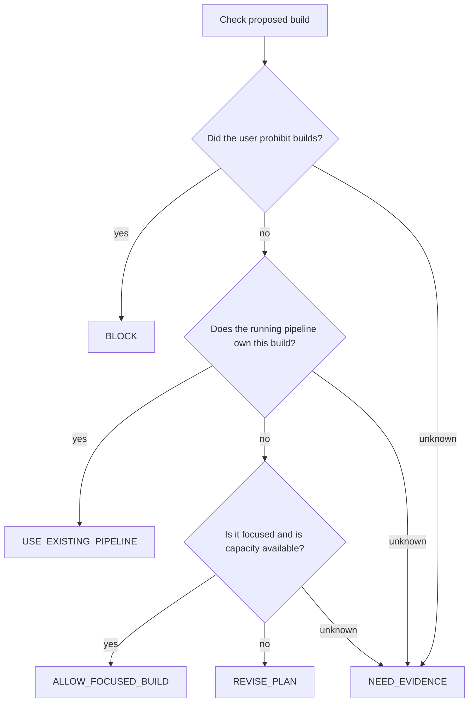

# MyScoutee trust decision prototype

A small local program that accepts structured facts, follows a fixed decision
tree and returns a decision, reason and next step. No model calls, API keys,
package installation or background processes. Requires Node.js 22 or newer.

```bash
node trust.mjs --demo
node trust.mjs examples/build-running.json
node --test test/trust.test.mjs
```

Run these commands from `myscoutee-agent`. The sibling `myscoutee-backend`
repository owns the policy documents. To use a different location:

```bash
node trust.mjs examples/build-running.json --backend /path/to/myscoutee-backend
```

## A concrete example

The coding agent wants to start a separate build. Its input is:

```json
{
  "check": "build",
  "intent": "Verify a backend fix with a separate build",
  "facts": {
    "buildProhibited": {
      "value": false,
      "evidence": "Example: the user requested a fix and verification without prohibiting builds."
    },
    "pipelineOwnsBuild": {
      "value": true,
      "evidence": "Example: the running hot-deploy pipeline builds the same module."
    }
  }
}
```

The result is `USE_EXISTING_PIPELINE`: the running process already owns that
build. The next step is to trigger the existing pipeline and inspect its logs.
The evidence above is **example data**, not an automatic inspection of the machine.



## Three supported checks

| `check` | What it checks | Meaning of a favorable result |
| --- | --- | --- |
| `build` | User prohibition, existing build owner, scope and capacity | A standalone build meets these limited prerequisites. |
| `before-edit` | Edit prohibition, observed failure, expected behavior, first incorrect boundary, existing implementations | The checked prerequisites are satisfied; this is not a code quality verdict. |
| `complete` | Focused verification, applicable persistence proof, final diff review, disclosed limitations | The supplied evidence supports preparing a report under these limited checks. |

Read [src/trust.mjs](src/trust.mjs) for the fact names and decision branches.
The `trace` records the path taken. Evaluation stops at the first unresolved
prerequisite or decision; a later favorable fact cannot override it.

Each fact has a `value` of `true`, `false` or `"unknown"`. Boolean assertions
need a non-empty `evidence` string. An absent fact, unknown value or missing
evidence returns `NEED_EVIDENCE`. This asks the agent to gather evidence;
it does not automatically ask the user a question. Misspelled fields,
unsupported checks and invalid types produce input errors.

## How an agent uses it

```text
Task -> agent investigates -> facts as JSON
     -> node trust.mjs request.json -> decision + next step
     -> agent continues work
```

Code can import `evaluateTrust(request)` directly. The CLI reads JSON and the
referenced policy files; it never executes the proposed action. Exit code `0`
means evaluation succeeded, and `1` means an input or source error. Exit code
`0` **does not grant permission**: callers must inspect `decision`.

This prototype is advisory and is not installed as a mandatory gate before
Codex tool calls. It cannot authenticate supplied evidence, check its freshness
or establish the actual task scope. The source SHA-256 hashes identify the
documents read during evaluation; they do not automatically prove that the
handwritten branches still match a later policy revision.

## Reusing the existing trust library

The backend `.agents/trust` directory remains the policy owner. This repository
implements a few explicit branches without copying the entire library. The CLI
checks that referenced source files are available and fingerprints them.
When policy changes, review the corresponding branch and tests together.

The two existing references are:

- `../myscoutee-backend/.agents/trust/kernel.md`: policy and selective loading.
- `../myscoutee-backend/tools/trust/run-trust-evals.mjs`: the existing model
  evaluation runner. It evaluates agent behavior rather than individual actions.

The missing capability is the small decision function implemented here. Its
scope is builds, bug diagnosis and completion evidence. Trust modes (`off`,
`light`, `standard`, `deep`) still govern the agent's document loading; this
program does not change them or replace the full trust protocol.

## Token usage

Rule evaluation makes zero model calls. Sending the request and reading the
response still consumes model context, and investigating the facts remains
work. JSON output is compact by default; the demo is formatted for readability.
Token savings have not been measured. Compare total agent usage on equivalent
tasks with equal correctness; a shorter response alone does not prove savings.
